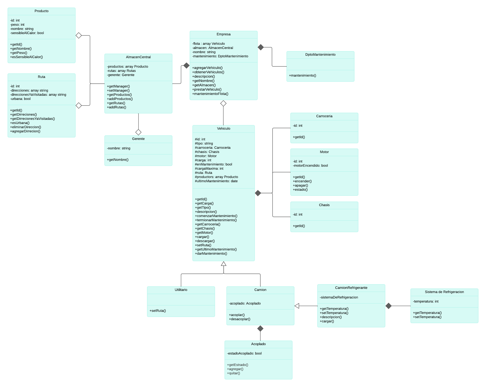
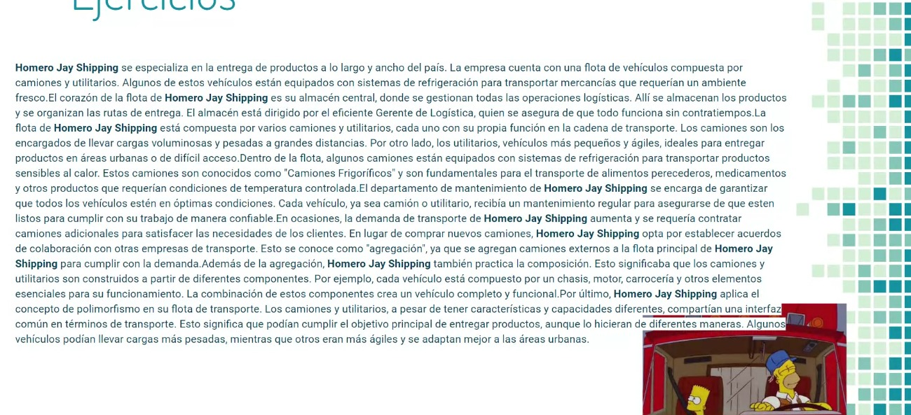

# 1er Trabajo Práctico - Programación Orientada a Objetos

**UNSO - Tecnicatura en Ciberseguridad - 2do año - 1er Cuatrimestre**

**Materia: 00307 - Programación Orientada a Objetos**

## Descripción

Este repositorio contiene el primer trabajo práctico de la materia Programación Orientada a Objetos.

## Integrantes del Grupo 5

- **Leandro Van Kemenade**
- **Gonzalo Reales**
- **Erick Yamo**

## Diagrama UML
[Diagrama](https://lucid.app/lucidchart/invitations/accept/inv_8b7cfe09-a04f-4b1c-8a0d-c88a6bf2fa14)

## Consigna del TP
